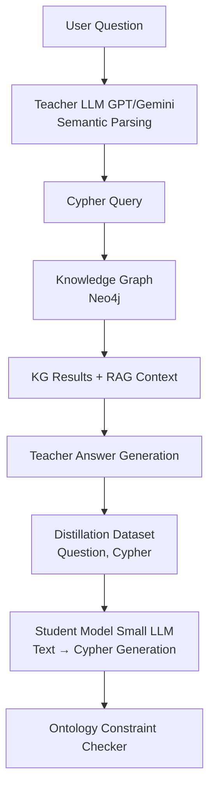

# Ontology-Constrained Knowledge Distillation for Query Generation in Medical LLM–KG–RAG Systems
### Chắt lọc tri thức dựa trên ràng buộc của ontology cho bài toán sinh truy vấn trong hệ thống LLM-KG y tế.

## 1. Research Motivation

Large Language Models (LLMs) đã chứng minh khả năng mạnh mẽ trong các hệ thống hỏi đáp tri thức, đặc biệt khi kết hợp với các kỹ thuật truy hồi như Retrieval-Augmented Generation (RAG). Tuy nhiên, trong các lĩnh vực yêu cầu độ chính xác cao như y tế, các LLM vẫn thường gặp vấn đề hallucination, thiếu khả năng reasoning có cấu trúc, và chi phí suy luận lớn khi triển khai thực tế.

Một hướng tiếp cận đang được quan tâm là tích hợp Knowledge Graph (KG) vào pipeline LLM để cung cấp tri thức có cấu trúc. Trong hệ thống chatbot y tế, KG có thể chứa các thực thể như bệnh, triệu chứng, thuốc, phác đồ điều trị và các quan hệ giữa chúng. Các truy vấn tri thức được thực thi trên graph database như Neo4j, trong khi các LLM như OpenAI GPT models hoặc Google Gemini được sử dụng để diễn giải câu hỏi và tổng hợp câu trả lời.

Tuy nhiên, pipeline này thường phụ thuộc vào các LLM lớn để dịch câu hỏi tự nhiên thành truy vấn KG (ví dụ Cypher). Điều này gây ra hai hạn chế chính:
1. Chi phí và độ trễ cao khi gọi API LLM lớn.
2. Thiếu đảm bảo về tính nhất quán ngữ nghĩa của truy vấn.

Do đó, nghiên cứu này đề xuất một phương pháp **Ontology-Constrained Knowledge Distillation**, nhằm huấn luyện một mô hình nhỏ hơn (student model) học cách sinh truy vấn KG từ pipeline LLM + KG + RAG hiện có. Ontology của KG được sử dụng như một nguồn tri thức biểu tượng để điều chỉnh quá trình distillation và đảm bảo tính hợp lệ của truy vấn sinh ra.

---

## 2. Application Scenario: Medical Chatbot

Ứng dụng mục tiêu là một chatbot hỗ trợ tri thức y tế, có khả năng trả lời các câu hỏi như:
* Thuốc nào điều trị cúm?
* Triệu chứng của viêm phổi là gì?
* Bệnh nào gây ra sốt và ho?

Knowledge Graph y tế chứa các thực thể như:
* Disease
* Symptom
* Drug
* Treatment
* Guideline

và các quan hệ như:
* causes
* treatedBy
* hasSymptom

Các thực thể và quan hệ này được định nghĩa bởi ontology của hệ thống.
Khi người dùng đặt câu hỏi, hệ thống cần:
1. Hiểu ý nghĩa câu hỏi.
2. Sinh truy vấn graph.
3. Lấy dữ liệu từ KG.
4. Kết hợp với tài liệu RAG.
5. Sinh câu trả lời tự nhiên.

Bài toán nghiên cứu tập trung vào bước quan trọng nhất của pipeline này: **sinh truy vấn KG từ câu hỏi tự nhiên.**

---

## 3. Overall System Architecture

Pipeline của hệ thống được thiết kế theo mô hình teacher–student distillation.
* **Teacher** là pipeline đầy đủ gồm LLM lớn, KG và RAG.
* **Student** là một mô hình nhỏ được huấn luyện để thay thế bước sinh truy vấn.

Pipeline teacher có cấu trúc:
User Question → LLM semantic parsing → Cypher query generation → Neo4j query execution → KG results → RAG retrieval → LLM answer synthesis.

Trong pipeline này:
* LLM lớn chịu trách nhiệm chuyển câu hỏi thành truy vấn Cypher.
* KG cung cấp tri thức có cấu trúc.
* RAG cung cấp ngữ cảnh từ tài liệu y khoa.

Toàn bộ pipeline được xem như teacher system. Student model sẽ học bắt chước hành vi sinh truy vấn của teacher.

### Figure: Ontology-Constrained Distillation Pipeline

Pipeline này cho phép student model học cách sinh truy vấn Cypher đồng thời tuân thủ các ràng buộc ontology của KG.

---

## 4. Related Work

### 4.1 Large Language Models with Knowledge Graphs
Việc kết hợp Large Language Models (LLMs) với Knowledge Graphs (KGs) đã trở thành một hướng nghiên cứu quan trọng nhằm cải thiện khả năng reasoning và giảm hallucination của các mô hình sinh ngôn ngữ. Một số nghiên cứu ban đầu đã khai thác KG như một nguồn tri thức bên ngoài để hỗ trợ hệ thống hỏi đáp.

Trong lĩnh vực question answering trên KG, các phương pháp trước đây chủ yếu dựa trên semantic parsing để chuyển đổi câu hỏi tự nhiên thành truy vấn graph như SPARQL (Berant et al., 2013; Yih et al., 2015). Với sự xuất hiện của các LLM hiện đại, nhiều nghiên cứu gần đây đã sử dụng LLM để trực tiếp sinh truy vấn hoặc reasoning trên KG.

Ví dụ, KG-BERT (Yao et al., 2019) sử dụng kiến trúc Transformer để mô hình hóa quan hệ trong knowledge graph. K-BERT (Liu et al., 2020) tích hợp tri thức từ KG vào quá trình encoding của BERT để cải thiện hiểu ngữ nghĩa.

Các hệ thống mới hơn kết hợp LLM với retrieval từ graph database như Neo4j nhằm xây dựng các hệ thống hỏi đáp tri thức. Trong các hệ thống này, các LLM như OpenAI GPT models và Google Gemini được sử dụng để diễn giải câu hỏi và sinh truy vấn graph.

Ngoài ra, các nghiên cứu gần đây trong hướng neuro-symbolic reasoning cũng nhấn mạnh vai trò của KG trong việc cung cấp reasoning có cấu trúc cho LLM (Sun et al., 2023; Pan et al., 2023). Tuy nhiên, các hệ thống này vẫn phụ thuộc vào các LLM lớn trong quá trình sinh truy vấn, dẫn đến chi phí suy luận cao.

### 4.2 Natural Language to Graph Query Generation
Bài toán chuyển đổi câu hỏi tự nhiên thành truy vấn database đã được nghiên cứu rộng rãi trong các bài toán Text-to-SQL và Text-to-SPARQL.

Một trong những dataset quan trọng trong lĩnh vực này là Spider (Yu et al., 2018), thúc đẩy sự phát triển của các mô hình semantic parsing dựa trên neural networks. Các mô hình như RAT-SQL (Wang et al., 2020) và BRIDGE (Lin et al., 2020) đã đạt được kết quả tốt trong bài toán Text-to-SQL bằng cách kết hợp schema encoding và attention mechanisms.

Đối với Knowledge Graph, bài toán tương tự là Text-to-SPARQL hoặc Text-to-Cypher. Các dataset như LC-QuAD (Trivedi et al., 2017) và WebQSP (Yih et al., 2016) được sử dụng rộng rãi để đánh giá các hệ thống question answering trên KG.

Gần đây, các LLM như LLaMA, Mistral và Qwen đã được áp dụng cho các bài toán Text-to-SQL hoặc Text-to-Cypher thông qua prompt engineering hoặc fine-tuning.

Tuy nhiên, các phương pháp này vẫn gặp một số hạn chế:
* Truy vấn sinh ra có thể vi phạm schema của graph.
* Sử dụng các quan hệ không tồn tại.
* Không đảm bảo domain và range của ontology.

Do đó, việc đưa ontology constraints vào quá trình huấn luyện có thể giúp cải thiện độ chính xác và tính nhất quán của truy vấn sinh ra.

### 4.3 Knowledge Distillation for Large Language Models
Knowledge Distillation (KD) được giới thiệu lần đầu bởi Hinton et al. (2015) nhằm chuyển tri thức từ một mô hình lớn (teacher) sang một mô hình nhỏ hơn (student). Kỹ thuật này đã được áp dụng rộng rãi trong nhiều bài toán NLP để giảm chi phí suy luận và cho phép triển khai mô hình trên các hệ thống có tài nguyên hạn chế.

Trong lĩnh vực LLM, KD thường được sử dụng để distill tri thức từ các mô hình lớn như OpenAI GPT models sang các mô hình nhỏ hơn như LLaMA hoặc Mistral.

Một số nghiên cứu tiêu biểu bao gồm:
* DistilBERT (Sanh et al., 2019), giảm kích thước BERT trong khi vẫn giữ phần lớn hiệu năng.
* TinyBERT (Jiao et al., 2020), sử dụng multi-stage distillation cho transformer models.
* MiniLM (Wang et al., 2020), distill attention distributions của transformer layers.

Trong bối cảnh LLM gần đây, các phương pháp distillation thường tập trung vào việc học ánh xạ:
**Question → Answer**

Tuy nhiên, đối với các hệ thống kết hợp LLM và Knowledge Graph, pipeline reasoning thường bao gồm nhiều bước trung gian như:
**Question → Query → KG → Answer**

Do đó, việc distill bước sinh truy vấn KG là một hướng nghiên cứu mới, đặc biệt khi kết hợp with ontology constraints để đảm bảo tính hợp lệ ngữ nghĩa của truy vấn.

---

## 5. Knowledge Graph and Ontology

Knowledge Graph được lưu trữ và truy vấn bằng Neo4j.
Ontology định nghĩa:
* Các lớp thực thể.
* Các quan hệ.
* Domain và range của quan hệ.
* Các ràng buộc logic.

Ví dụ: `treatedBy`
* **Domain:** Disease
* **Range:** Drug

Ontology đóng vai trò quan trọng trong nghiên cứu này vì nó cho phép:
1. Kiểm tra tính hợp lệ của truy vấn.
2. Tạo constraint loss khi huấn luyện.
3. Phát hiện và loại bỏ truy vấn sai.

Nhờ đó student model không chỉ học bắt chước teacher mà còn học tuân thủ tri thức cấu trúc của KG.

---

## 6. Distillation Dataset Construction

Dataset distillation được thu thập từ pipeline teacher trong quá trình hệ thống hoạt động. Mỗi truy vấn người dùng sẽ được log lại với đầy đủ thông tin trung gian.

Một sample dữ liệu có cấu trúc:
* `question`
* `generated_cypher`
* `kg_result`
* `retrieved_documents`
* `final_answer`
* `reasoning_trace`
* `ontology_constraints`

Trong đó:
* **question:** Câu hỏi người dùng.
* **generated_cypher:** Truy vấn sinh bởi teacher.
* **kg_result:** Kết quả từ KG.
* **retrieved_documents:** Context từ RAG.
* **final_answer:** Câu trả lời cuối.

Đối với mục tiêu distill bước sinh truy vấn, phần quan trọng nhất là cặp: **(question, cypher_query)**.

Dataset được làm sạch bằng cách:
1. Chuẩn hóa cú pháp Cypher.
2. Loại bỏ truy vấn lỗi.
3. Kiểm tra ontology constraints.
4. Xác nhận truy vấn thực thi thành công trên KG.

---

## 7. Synthetic Data Generation

Để mở rộng dataset, hệ thống có thể sinh dữ liệu tổng hợp từ KG. Các template câu hỏi được tạo dựa trên cấu trúc ontology.

Ví dụ: `Disease treatedBy Drug` có thể sinh các câu hỏi:
* Thuốc nào điều trị bệnh X?
* Bệnh X được điều trị bằng thuốc gì?

Việc này cho phép sinh hàng triệu cặp dữ liệu training từ KG. Teacher LLM như OpenAI GPT models hoặc Google Gemini có thể được sử dụng để paraphrase câu hỏi, tăng độ đa dạng ngôn ngữ.

---

## 8. Student Model

Student model là một LLM nhỏ hơn, ví dụ: LLaMA, Mistral, hoặc Qwen.

* **Input của model:** Question + KG schema summary.
* **Output:** Cypher query.

**Ví dụ:**
* **Input:** Thuốc nào điều trị cúm?
* **Output:** `MATCH (d:Disease{name:"Flu"})-[:treatedBy]->(x:Drug) RETURN x`

---

## 9. Ontology-Constrained Distillation Objective

Loss function của mô hình gồm ba thành phần chính:

1. **Knowledge Distillation Loss:** Student học dự đoán token giống teacher query.
2. **Ontology Constraint Loss:** Phạt nếu truy vấn vi phạm ontology.
   * *Ví dụ:* `Disease treatedBy Symptom` là quan hệ sai vì range của `treatedBy` phải là Drug.
3. **Execution Loss:** Truy vấn sinh ra được thực thi trên KG. Phạt nếu:
   * Lỗi cú pháp.
   * Truy vấn rỗng.
   * Truy cập quan hệ không tồn tại.

**Tổng loss:**
`L_total = L_KD + λ1 L_ontology + λ2 L_execution`

---

## 10. Experimental Setup

### 10.1 Proposed Datasets
Đối với bài toán Text-to-Cypher và QA trên Knowledge Graph, có thể sử dụng các dataset sau:

#### 1. LC-QuAD 2.0
Dataset phổ biến cho QA trên knowledge graph.
* Câu hỏi tự nhiên.
* SPARQL query.
* Entity linking.
*(Có thể chuyển đổi SPARQL sang Cypher để huấn luyện model)*.

#### 2. WebQSP
Dataset QA trên Freebase.
* Câu hỏi.
* Graph queries.
* Answer entities.
*(Phù hợp để đánh giá khả năng reasoning trên graph)*.

#### 3. MetaQA
Dataset QA nhiều bước trên knowledge graph.
* Single-hop, two-hop, three-hop reasoning.
*(Rất phù hợp để đánh giá khả năng sinh truy vấn phức tạp)*.

#### 4. BioMedical Knowledge Graph Datasets
Đối với chatbot y tế, có thể sử dụng các nguồn dữ liệu y khoa như: UMLS, DrugBank, Disease Ontology. Các nguồn này có thể được chuyển thành Knowledge Graph và lưu trong Neo4j. Sau đó có thể sinh dữ liệu QA từ graph.

---

### 10.2 Distillation Dataset Construction
Dataset distillation được tạo từ teacher pipeline. Mỗi sample có dạng: `(question, cypher_query, kg_result, retrieved_context, final_answer)`.

Trong quá trình huấn luyện student model, cặp dữ liệu chính là: **(question, cypher_query)**.
Dataset có thể được mở rộng bằng cách:
* Sinh câu hỏi từ KG.
* Paraphrase bằng LLM.
* Tạo multiple query patterns.

---

### 10.3 Evaluation Metrics
Các metric được sử dụng trong thực nghiệm gồm:

* **Query Exact Match:** Tỷ lệ truy vấn sinh ra giống truy vấn ground truth.
* **Execution Accuracy:** Tỷ lệ truy vấn chạy thành công và trả kết quả đúng.
* **Ontology Violation Rate:** Tỷ lệ truy vấn vi phạm domain/range của ontology.
* **End-to-End QA Accuracy:** Độ chính xác của câu trả lời cuối cùng trong hệ thống chatbot.

---

### 10.4 Baselines
Các phương pháp so sánh gồm:
1. **Prompt-based LLM:** Sử dụng trực tiếp LLM lớn như OpenAI GPT models để sinh truy vấn.
2. **Fine-tuned Student Model:** Fine-tune student model mà không dùng ontology constraints.
3. **Ontology-Constrained Distillation (proposed):** Phương pháp đề xuất trong nghiên cứu này.

---

## 11. Benchmark Evaluation

Pipeline đánh giá gồm:
**Question → Student query generation → Neo4j execution → KG results → Answer synthesis.**

Kết quả được so sánh với teacher pipeline sử dụng LLM lớn. Các thí nghiệm đo:
* Độ chính xác.
* Độ trễ.
* Chi phí suy luận.

**Kỳ vọng student model có thể:**
* Đạt độ chính xác gần teacher.
* Giảm chi phí suy luận.
* Chạy được trên hạ tầng nhỏ hơn.

---

## 12. Expected Contributions

Nghiên cứu dự kiến mang lại ba đóng góp chính:
1. Đề xuất một framework **ontology-constrained distillation** cho hệ LLM + KG.
2. Xây dựng **pipeline distillation** cho bài toán natural language to graph query generation.
3. Chứng minh hiệu quả của phương pháp trong ứng dụng **chatbot y tế**.

Phương pháp này kết hợp giữa:
* Reasoning của LLM.
* Tri thức có cấu trúc của KG.
* Logic constraints của ontology.
Tạo nên một hướng tiếp cận neuro-symbolic AI cho các hệ thống hỏi đáp tri thức.

---

## References

* Berant, J., Chou, A., Frostig, R., & Liang, P. (2013). *Semantic parsing on Freebase from question-answer pairs*. ACL.
* Yih, W., Chang, M., He, X., & Gao, J. (2015). *Semantic parsing via staged query graph generation*. ACL.
* Yu, T. et al. (2018). *Spider: A large-scale human-labeled dataset for complex and cross-domain semantic parsing and text-to-SQL task*. EMNLP.
* Wang, B. et al. (2020). *RAT-SQL: Relation-aware schema encoding for text-to-SQL parsers*. ACL.
* Trivedi, P. et al. (2017). *LC-QuAD: A corpus for complex question answering over knowledge graphs*. ISWC.
* Yih, W. et al. (2016). *The value of semantic parse labeling for knowledge base question answering*. ACL.
* Hinton, G., Vinyals, O., & Dean, J. (2015). *Distilling the knowledge in a neural network*.
* Sanh, V. et al. (2019). *DistilBERT: A distilled version of BERT*.
* Jiao, X. et al. (2020). *TinyBERT: Distilling BERT for natural language understanding*.
* Wang, W. et al. (2020). *MiniLM: Deep self-attention distillation for task-agnostic compression of pre-trained transformers*.
* Liu, W. et al. (2020). *K-BERT: Enabling language representation with knowledge graph*. AAAI.
* Yao, L. et al. (2019). *KG-BERT: BERT for knowledge graph completion*.
